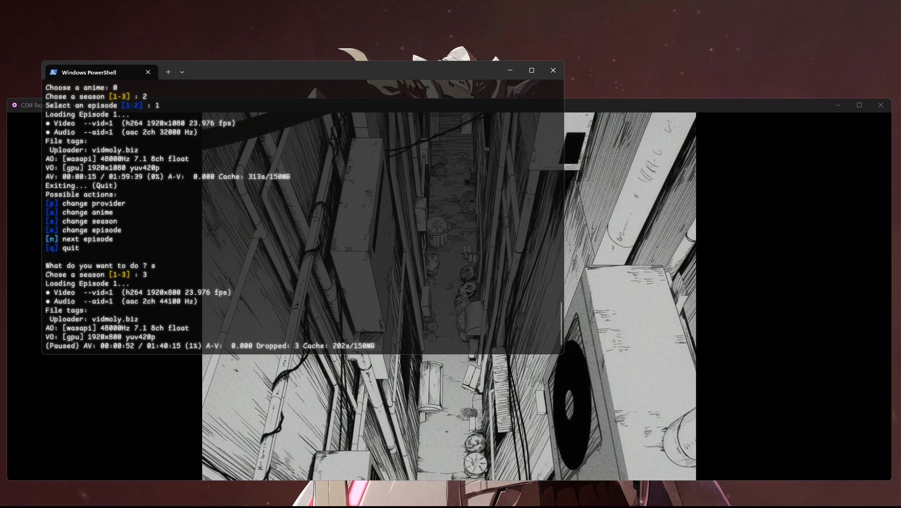

# ANIME WATCHER

## What is this ? ⭐




Anime Watcher is a python program that allows you to watch anime in french in your terminal like a true nerddd

## Installation 🚀
### Prerequisites
* A supported platform:
  * Windows
  * MacOS
  * Linux
  * Android (via [Termux](https://termux.dev/en/))
  * IOS (via [iSH Shell](https://ish.app/))
* [python](https://ish.app/) (required with **pip** for sure and make sure you can run it through your terminal)
* [mpv](https://mpv.io/installation/) (**Required** media player)

### Install python

You need to install [Python 3.12.4](https://www.python.org/downloads/release/python-3124/) or any other version realeased after. Make sure you add it to the
path and install PIP (which are options to check during the installation process).

### Install MPV

It is recommended to install MPV using scoop. First install scoop by running in your PowerShell the following command:

```ps1
Set-ExecutionPolicy -ExecutionPolicy RemoteSigned -Scope CurrentUser
Invoke-RestMethod -Uri https://get.scoop.sh | Invoke-Expression
```

Then install MPV and youtube-dl by running this command in your CLI:

```bat
scoop bucket add extras
scoop install extras/mpv
scoop bucket add main
scoop install main/yt-dlp
```

### Install Anime Watcher
With the prerequisites installed, anime-watcher-fr can be installed via the pip command on all platform
with Python version 3.10 or above.
```bat
pip install anime-watcher-fr
```

### Usage 🎰

https://github.com/user-attachments/assets/36df723c-d7c1-4c19-99b0-28d93d32f2f0

anime-watcher comes packaged with a CLI interface via the ```anime-watcher```
command that you can use in your respective terminal.

